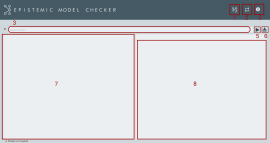

<p align="center">
  
</p>

## Indice

* [Introducción](#introduction)
* [Primeros Pasos](#primeros)
	* [Dependencias](#dependencias)
	 * [Instalación](#install)
 * [Manual de uso](#manual)
	 * [Interfaz](#interfaz)
	  * [Introducción de modelos](#modelo)
	  * [Introducción de fórmulas](#formula)
* [Desarrolladores](#community)
* [Licencia](#license)

## Introducción <a name="introduction"></a>
**EpistemicModelChecker (EMC)** un programa capaz de evaluar el
estatus semántico de una fórmula epistémica en modelos multiagentes. El proceso de evaluación utilizado es el que describe el algoritmo *model checking*.


## Primeros pasos {#primeros}
### Dependencias{#dependencias}
Para poder ejecutar **EMC** basta con tener instalado una versión java superior a JAVA 11. La última versión de puede ser descargada en el siguente enlace: [Java 14](https://www.oracle.com/java/technologies/javase/jdk14-archive-downloads.html). 
Descargar y compilar el código se requiere además de la última versión de [JavaFX](https://gluonhq.com/products/javafx/)

### Instalación{#install}


## Manual de uso {#manual}
### Interfaz {#interfaz}
<p align="center">
  
</p>
1. Introducir nuevo modelo
2. Recargar modelo
3. Ayuda
4. Campo de texto donde introducir la fórmula
5. Ejecutar el verificador
6. Limpiar interfaz
7. Área de texto donde se muestra el resultado
8. Área gráfica donde se muestra el grafo del modelo

### Introducción de modelos{#modelo}
La introducción del modelo consiste en la creación de un archivo de texto (txt) en donde se escribe el modelo siguiendo la notación matemática. Aportamos ahora un ejemplo, así como algunas consideraciones a tener en cuenta.
```
W={w0,w1,w2}
Ra={<w0,w1>,<w2,w2>}
Rc={<w1,w1>,<w2,w1>}
Rb={<w2,w1>,<w0,w0>}
V(p)={w0,w1,w2}
V(q)={w2,w1}
V(r)={w0}
```
* Se pueden crear hasta un máximo de 10 mundos, empezando siempre por w0.
* El número de agentes está restringido a 4; a, b, c y d.
* El dominio de los átomos interpretables por **EMC** es: {p,q,r,s,t,u,v,w,x,y,z}

### Introducción de fórmulas {#formula}
La sintaxis para la introducción de fórmulas es la siguiente. 

| Operador     | Ejemplo notación  clásica  | Ejemplo notación EMC 
 ------------- |:-------------:| :-------------:|
 |Negación* | ¬p | \lnot( p )    
| Conjunción   |  p ∧ q | p \land q |
| Disyunción     | p v q       |   p \lor q |
| Implicación | p → q     |  p \to q |
| Equivalencia | p ↔ q | p \eq q |
| Conocimiento* | K<sub>a</sub>p | Ka( p )|
| Dual del conocimeinto*|  M<sub>a</sub>p | Ma( p ) |

*Es importante recalcar que los operadores monádicos deben escribirse siempre manteniendo los paréntesis que delimiten la fórmula a la que afectan

## Desarrolladores {#community}
El proyecto ha sido desarrollado por 
* Carlos Aguilera Ventura (carlos.aguilera13416@gmail.com)
* Alfredo Burrieza Muñiz
* Antonio Yuste Ginel
## Licencia {#licence}
EMC está licenciado bajo GNUv3, véase:[LICENCE](https://github.com/CaAgVe/EpistemicModelChecker/blob/Release_1.01/licence) 
