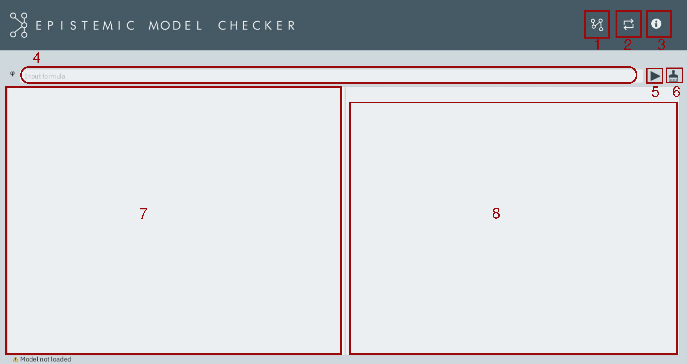

<p align="center">
  
</p>

## Index <a href="README_ES.md"></a> 
* [Introduction](#introduction)
* [Getting Started](#primeros)
	* [Dependencies](#dependencias)
    * [Installation](#install)
 * [Use](#manual)
    * [Interface](#interfaz)
    * [Model input](#modelo)
    * [Formula input](#formula)
    * [Usage example](#ejemplo)
* [Developers](#community)
* [Licence](#licence)

## Introduction <a name="introduction"></a>
**EpistemicModelChecker (EMC)** is a software tool for determining the truth value of modal formulas in Kripke-style multi-agent models.
The used evaluation process is the one described by the *model checking algorithm*. In the development of the program two libraries have been used:
[Tweety project](https://tweetyproject.org/) y [GraphStream](http://graphstream-project.org/). **EMC** is the first stage of a wider project under development. 
Any suggestion, bug detection, etc will be appreciated. You can post an issue in github (https://github.com/cagve/EpistemicModelChecker/issues) or send a [mail](#mail). 

## Getting started <a name="primeros"></a>
### Dependencies <a name="dependencias"></a>
To execute **EMC** is necessary to have an older version than JAVA 11.
If you want to download the code and compile it, you will need the last version of [JavaFX](https://gluonhq.com/products/javafx/)


### Installation <a name="install"></a>

Download the **EMC** installer for your operating system in: [Downloads](https://github.com/cagve/EpistemicModelChecker/releases/tag/v2).


## Use <a name="manual"></a>
### Interface <a name="interfaz"></a>
<p align="center">
  
</p>

 1. Introduce a new model
 2. Reload the model
 3. Help
 4. Formula field text
 5. Run the checker
 6. Clean the interface
 7. Return area
 8. Graph area 

### Model input <a name="modelo"></a>
To introduce the model you need to create a text file (txt) where the model is written following the mathematical notation. An example and some considerations to be taken into account are provided.
```
W={w0,w1,w2}
Ra={<w0,w1>,<w2,w2>}
Rc={<w1,w1>,<w2,w1>}
Rb={<w2,w1>,<w0,w0>}
V(p)={w0,w1,w2}
V(q)={w2,w1}
V(r)={w0}
```
* **You can not** create more than 10 worlds: {w0,w1,w2,w3,w4,w5,w6,w7,w8,w9}, begining always with w0.
* **You can not** create more than 4 agents: a, b, c and d.
* The **domain** of the atom set is: {p,q,r,s,t,u,v,w,x,y,z}
* Some model **example** are available here: [ejemplo de modelos](https://github.com/cagve/EpistemicModelChecker/releases/tag/v1) 

### Formula input <a name="formula"></a>
Check the syntaxis of the formula in this table.

| Operator | Classic notation  | EMC notation
 ------------- |:-------------:| :-------------:|
| Negation* | ¬p | \lnot( p )    
| Conjunction |  p ∧ q | p \land q |
| Disjunction | p v q       |   p \lor q |
| Implication | p → q     |  p \to q |
| Biconditional | p ↔ q | p \eq q |
| Knowledge* | K<sub>a</sub>p | Ka( p )|
| Dual of knowledge*|  M<sub>a</sub>p | Ma( p ) |

* **Always** use parenthesis to write the monadic operator.

#### Usage example <a name="ejemplo"></a>
<p align="center">
  
</p>

## Developers <a name="community"></a>
The project has been developed for a final degree work (TFG) in the philosophy department of the University of Málaga by:
* Carlos Aguilera Ventura: carlos.aguilera13416@gmail.com<a name="mail"></a>
Supervised by:
* Alfredo Burrieza Muñiz
* Antonio Yuste Ginel
## Licencia <a name="licence"></a>
EMC is licensed by GNUv3 : [LICENCE](https://github.com/CaAgVe/EpistemicModelChecker/blob/Release_1.01/licence) 
